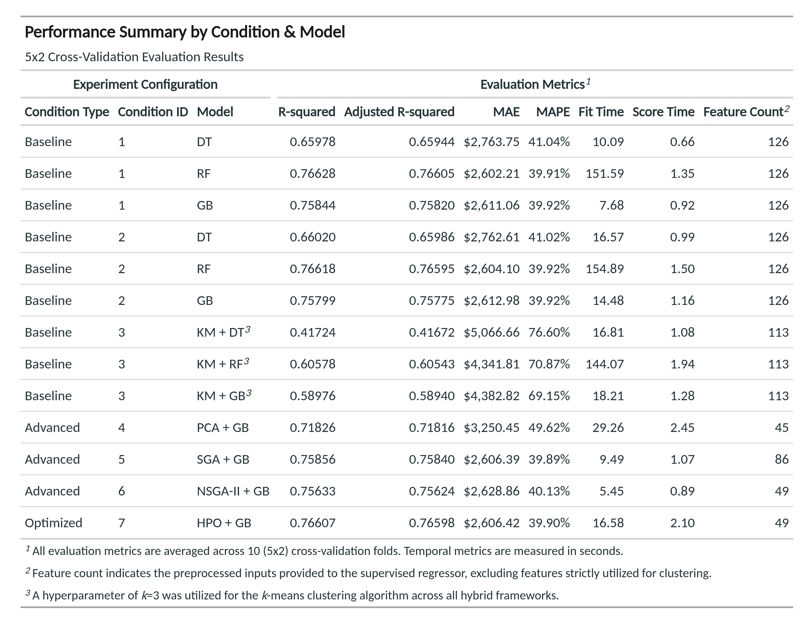
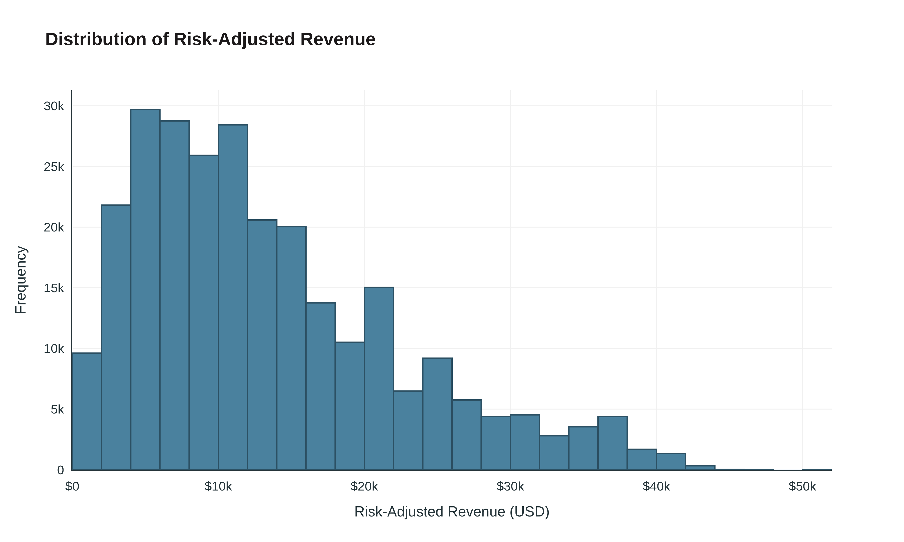
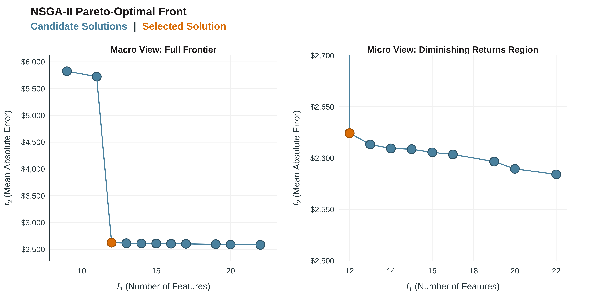
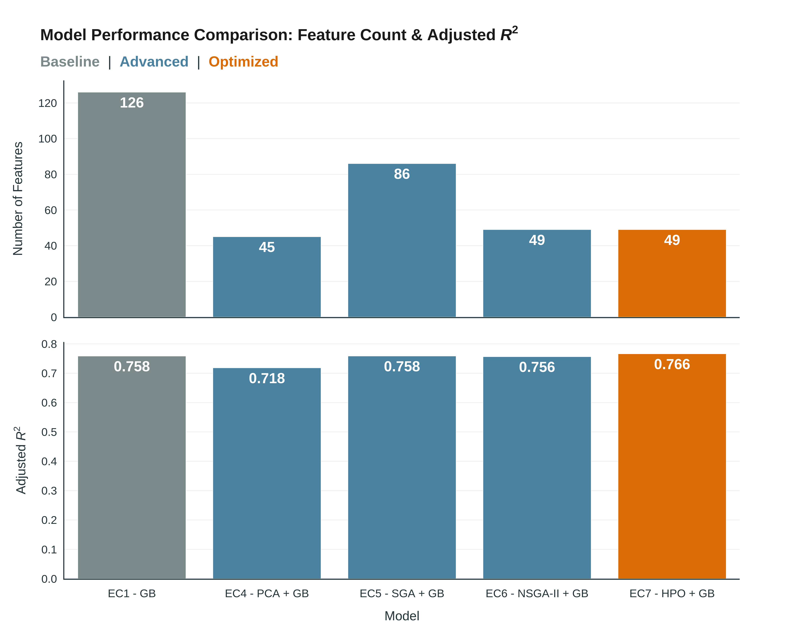
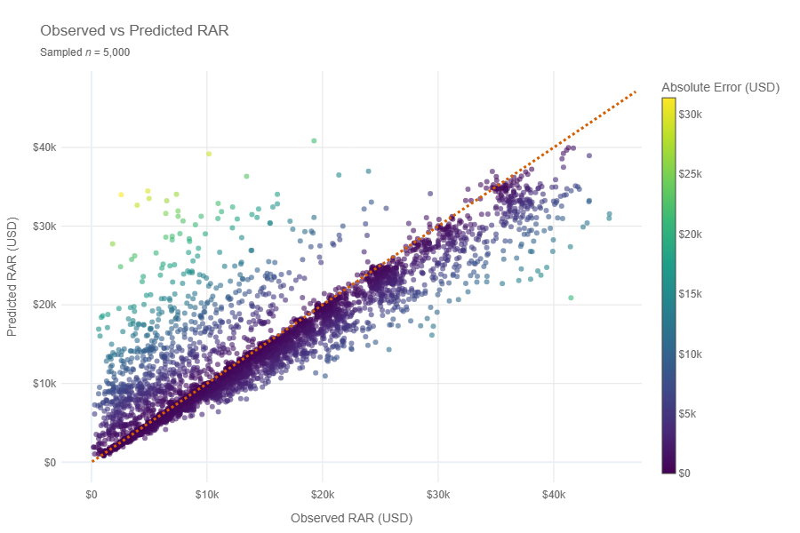

# A Bi-Objective Evolutionary Approach to Feature Selection for Customer Value Prediction in Fintech

## Project Overview
Assessing customer value is integral to data-driven resource allocation in the fintech industry. While previous hybrid machine learning (ML) frameworks predict customer risk-adjusted revenue (RAR) in peer-to-peer lending, these implementations suffer from inordinate dimensionality, excessive opacity, and methodological invalidity rooted in data leakage. Building on the existing literature, this project constructs a leakage-aware benchmark ML pipeline for RAR prediction and extends it utilizing a bi-objective genetic algorithm (GA) for feature selection alongside SHapley Additive exPlanations (SHAP) for post-hoc explainability analysis. Drawing upon the LendingClub (LC) dataset and open-source Python libraries, we establish a baseline model incorporating the full preprocessed feature set and subsequently generate a Pareto-optimal front of subset models, extracting the most parsimonious candidate for hyperparameter tuning and SHAP-based analysis.

## Project Structure
The project's root directory, called `p2p-customer-value-prediction`, contains the following key subdirectories:
* `data`
    * `interim` &rarr; Intermediate data that has been transformed (e.g., `sampled_loans.csv`).
    * `processed` &rarr; The final, canonical dataset for modeling (e.g., `cleaned_loans.csv`).
    * `raw` &rarr; The original, immutable data dump (e.g., `raw_loans.csv`).
* `notebooks` &rarr; Jupyter notebooks, numbered sequentially by intended order of execution.
* `outputs` &rarr; Key execution outputs for carryover across notebooks (e.g., `eval_dict.pkl`)
* `references` &rarr; Explanatory materials such as data dictionaries.
* `reports`
    * `figures` &rarr; Generated graphics and figures to be used in reporting.

This directory structure aligns with the standardized directory structure proposed by [Cookiecutter Data Science](https://cookiecutter-data-science.drivendata.org/).
Note that the project directory does **not** contain any production-grade Python scripts, which fall beyond the scope of this project.

**Note:** Due to file size limitations, the original raw dataset is **not** provided in this repository. It must be downloaded [here](https://www.kaggle.com/datasets/wordsforthewise/lending-club) and deposited into the `data/raw` subdirectory before execution.

## Dependencies
The requirements/libraries that need to be installed to run this project are as follows:
* `fredapi`
* `gc`
* `google` (if running in Google Colab environment, as strongly recommended)
* `great_tables`
* `html2image`
* `kaleido`
* `matplotlib`
* `mlxtend`
* `numpy`
* `numpy-financial`
* `os`
* `pandas`
* `pickle`
* `plotly`
* `pymoo`
* `Python 3.12.13`
* `random`
* `scipy`
* `seaborn`
* `shap`
* `sklearn`
* `xgboost`

## How to Run
**Note:** This project is configured to run in a free-tier Google Colab cloud notebook environment. The first code cell of every notebook contains a variable called `BASE_PATH`. Users must change this variable to specify their local directory in accordance with their Google Drive directory structure. Additionally, an API key is required to pull the FEDFUNDS series via the FRED API. An API key can be obtained [here](https://fred.stlouisfed.org/docs/api/api_key.html) (free user account required).

Notebooks are intended to be executed in the following order, which mirrors our experimental workflow:
1. `01_data_collection_and_target_engineering.ipynb` &rarr; Ingests, samples, and integrates LC and FEDFUNDS datasets. Engineers RAR target variable. Outputs downsampled, labeled dataset `sampled_loans.csv`.
2. `02_exploratory_data_analysis.ipynb` &rarr; Performs exploratory data analysis.
3. `03_data_cleaning.ipynb` &rarr; Conducts global data cleaning prior to model training. Outputs cleaned dataset `cleaned_loans.csv`.
4. `04_data_preprocessing_and_baseline_modeling.ipynb` &rarr; Performs pipeline-embedded preprocessing operations. Develops and evaluates baseline models.
5. `05_advanced_modeling_and_optimization.ipynb` &rarr; Develops and evaluates advanced models. Performs hyperparameter tuning on final model. Conducts preliminary feature importance analysis.
6. `06_model_validation.ipynb` &rarr; Validates final model results. Performs robustness/reliability analysis, error analysis, and SHAP-based explainability analysis.
7. `07_statistical_significance_testing.ipynb` &rarr; Conducts statistical significance testing on baseline vs. final model performance results.
8. `08_visualization_refinement.ipynb` &rarr; Constructs refined, publication-ready plots and tables for reporting.

## Results
At a high level, the final model is an XGBoost regressor trained on a 12-variable feature subset and tuned via randomized search, which achieves an adjusted $R^2$ of approximately 0.766 and an MAE of approximately \$2,606, with a coefficient of variation of less than 0.3% over ten cross-validation folds. Relative to the baseline, the final model reduces raw feature input by 80.3% and encoded features by 61.1% while maintaining statistically indistinguishable predictive performance ($p$ = 0.8353).

More granularly, the results obtained across all experiments are presented in the table below.

Additionally, a sampling of key plots is provided below.

## Contact
<u>**Contact 1**</u>
* **Name:** Brennan Mason
* **Email Address:** brennan.mason@ontariotechu.net

<u>**Contact 2**</u>
* **Name:** Mohammad Shah
* **Email Address:** mohammad.shah3@ontariotechu.net